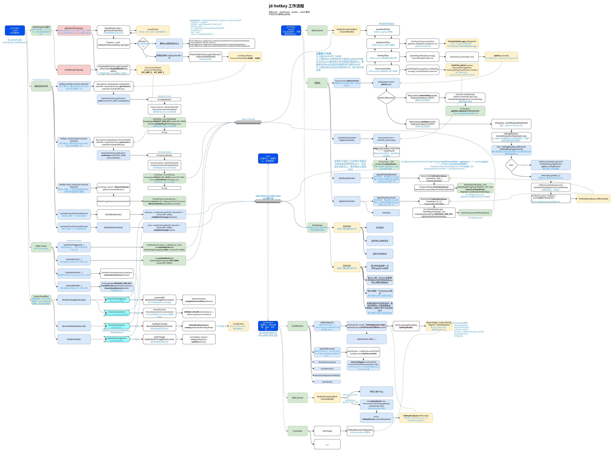

# go-hotkey

[jd-hotkey](https://gitee.com/jd-platform-opensource/hotkey)

由于jd-hotkey提供的功能很通用（限流、热键探测等），基本所有项目都能用，这里研究了下源码实现，并打算参考下写个Go实现版本。

**源码分析**：

+ [jd-hotkey 部署测试](docs/jd-hotkey.md)

+ [jd-hotkey 源码分析](docs/jd-hotkey.md)

  主线流程图：

  

**go-hotkey实现：**

TODO