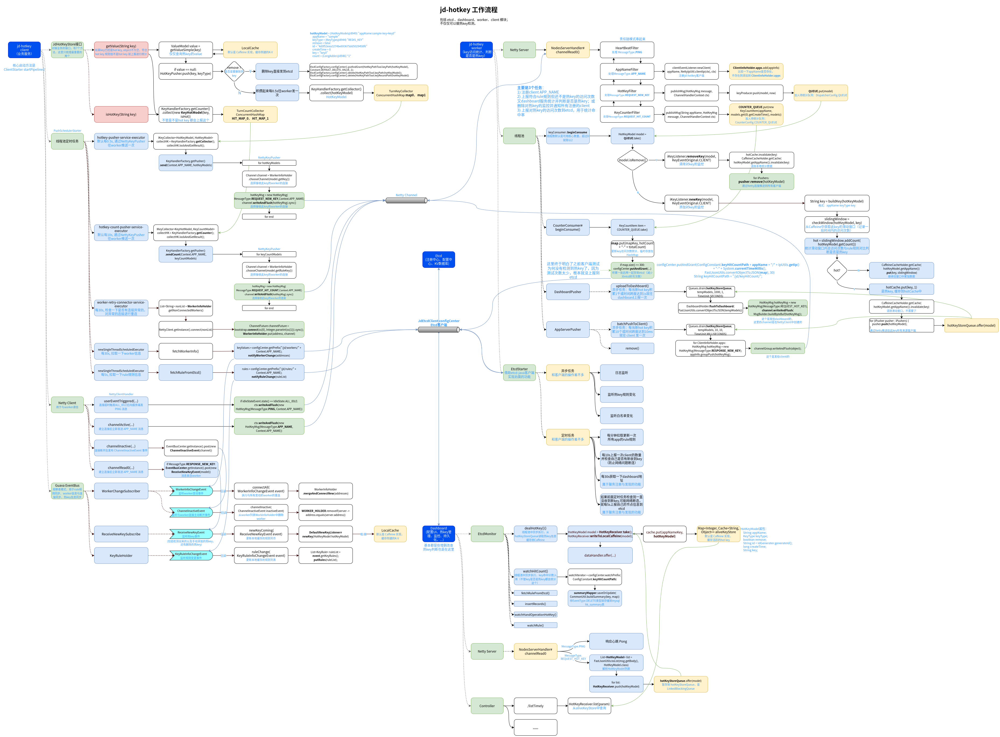

# jd-hotkey

**开源仓库**：

[京东零售](https://gitee.com/jd-platform-opensource) / [hotkey](https://gitee.com/jd-platform-opensource/hotkey)

代码轻量（Java源码共9K多行），部署简单。不过文档（只有README.md）很简陋，不过代码简单，很多使用细节可以看源码推导。

**服务模块**：

+ etcd

  KV数据库，用作配置中心（存储热key规则配置，以及热key各维度的统计信息）、服务注册与发现（存储客户端和worker各个实例信息和工作状态）

+ worker

  可以有多个，根据每秒待测key数量调整，worker节点信息会上报到etcd，然后客户端client（业务服务）才知道自己收集的待探测的key应该发到哪里进行统计计算；worker会获取热key规则对client上报的key进行聚合上报（上报到etcd），热key统计是在dashboard中完成的。

+ client

  业务服务，会获取热key规则，通过规则收集及上报热key到hash计算后指定的worker。

+ dashboard

  控制台，用于查看worker client 各个实例信息和工作状态、对热key规则进行增删改查、统计key访问次数进行热key判断、查看热key频率、已缓存数量等统计信息，持久化统计数据到MySQL。

**应用场景**：

+ mysql热数据本地缓存
+ redis热数据本地缓存
+ 黑名单用户本地缓存
+ 爬虫用户限流
+ 接口、用户维度限流
+ 单机接口、用户维度限流限流
+ 集群用户维度限流
+ 集群接口维度限流


## 安装部署

**安装etcd**:

官方提供了安装脚本，默认装到了/tmp，这里手动修改下。

```shell
ETCD_VER=v3.4.24

# choose either URL
GOOGLE_URL=https://storage.googleapis.com/etcd
GITHUB_URL=https://github.com/etcd-io/etcd/releases/download
DOWNLOAD_URL=${GITHUB_URL}
INSTALL_DIR=/home/lee/bin

rm -f ${INSTALL_DIR}/etcd-${ETCD_VER}-linux-amd64.tar.gz
rm -rf ${INSTALL_DIR}/etcd-download-test && mkdir -p ${INSTALL_DIR}/etcd-download-test

curl -L ${DOWNLOAD_URL}/${ETCD_VER}/etcd-${ETCD_VER}-linux-amd64.tar.gz -o ${INSTALL_DIR}/etcd-${ETCD_VER}-linux-amd64.tar.gz
tar xzvf ${INSTALL_DIR}/etcd-${ETCD_VER}-linux-amd64.tar.gz -C ${INSTALL_DIR}/etcd-download-test --strip-components=1
rm -f ${INSTALL_DIR}/etcd-${ETCD_VER}-linux-amd64.tar.gz
# 服务端
${INSTALL_DIR}/etcd-download-test/etcd --version
# 客户端
${INSTALL_DIR}/etcd-download-test/etcdctl version
```

**启动etcd**:

这里选择单机启动，只是为了测试jd-hotkey。

```shell
./etcd
```

为方便查看装下etcdv3-browser（Web应用），图方便直接用docker镜像安装：

```shell
docker pull joinsunsoft/etcdv3-browser:1.0.0
docker run -d --name=etcdv3-browser -p 9980:80 joinsunsoft/etcdv3-browser:1.0.0
# http://localhost:9980 Username: ginghan Password: 123456
```

**启动worker**:

worker是spring boot web应用，内部启动了Tomcat（port:8080）和Netty服务器（port:11111），暂时先启动一个节点。

```shell
# jar包启动
java -jar $JAVA_OPTS worker-0.0.1-SNAPSHOT.jar --etcd.server=${etcdServer}
# IDE启动
# 命令行参数：默认 http://127.0.0.1:2379
--etcd.server=${etcdServer}
```

**启动dashboard**：

dashboard是spring boot web应用，页面使用模板引擎实现，端口8081，用户名密码：admin/123456。

需要先初始化MySQL数据库hotkey_db，导入resource下db.sql文件，修改application.yml（数据库useSSL=false）。

建了８张表：

+ biz_access_token
+ hk_change_log
+ hk_key_record
+ hk_key_timely
+ hk_rules
+ hk_statistics
+ hk_summary
+ hk_user

**启动client**:

源码client包只是根据规则采集上报热key的组件（包含Netty客户端），需要在业务服务中引入此组件，官方提供了测试应用sample，可以启动并在这个web应用中测试。


## 工作原理

**官方架构图：**


**源码流程图：**

看源码总结的核心流程。




## 功能模块

### client上报

+ **获取热key规则**

  + **连接etcd**

    使用etcd-java客户端实现，类是 JdEtcdClient.java。

  + **获取规则信息**

    + **规则定义**

      jd-hotkey对于热key规则定义没找到资料，看配置页面格式是json或xml,包含下面字段：

      ```
      key-(*代表任意以key为前缀), prefix-是否前缀, interval-间隔时间(秒), threshold-阈值, duration-缓存时间(秒),默认60
      ```

      推测规则用json表示是：

      ```json
      # 以key为前缀２秒内出现达到10次，即为热key,热key缓存60s
      {
      	"key": "key",
      	"prefix":true,
      	"interval":2,
      	"threshold":10,
      	"duration":60
      }
      #经过测试发现必须传成json数组格式，再改为下面格式成功，另外也可以额外加些拓展字段
      [{
      	"key": "key",
      	"prefix":true,
      	"interval":2,
      	"threshold":10,
      	"duration":60
      }]
      ```

      所属APP: 添加规则必须指定所属APP，但是下拉可选列表为空，也不能手写，没查到资料，看前端源码发现来源于用户信息表，有个app_name列。

      > 所属APP来源：Ajax请求“/user/info”接口读取hk_user的app_name列，然后将值比对后填充到下拉列表。
      >
      > 所以下拉列表为空是因为app_name为空，这里填充“sample”。
      >
      > ```javascript
      > success : function(data) {
      > 	console.log(data)
      > 	var role = data.role;
      > 	if(role === "ADMIN"){
      > 		$("#apps").append("<option></option>");
      > 	}
      > 	var apps = data.appNames;
      > 	var appName = data.appName;
      > 	for (var i = 0; i < apps.length; i++) {
      > 		var app = apps[i];
      > 		if(app === appName){
      > 			$("#apps").append("<option selected = selected>" + apps[i] + "</option>");
      > 		}else{
      > 			$("#apps").append("<option>" + apps[i] + "</option>");
      > 		}
      > 	}
      > }
      > # UPDATE `hotkey_db`.`hk_user` SET `app_name`='sample' WHERE `id`='2';
      > ```

      Rules类数据结构

      ```java
      //自增主键
      private Integer id;
      //规则的json或xml字符串
      private String rules;
      //所属应用app
      private String app;
      private String updateUser;
      private Date updateTime;
      private Integer version;
      ```

  + **注册规则变更监听**

  + **注册hotkey变更监听**

+ **key收集上报**

  + **规则的使用**

    规则怎么用文档也没说，还是看源码，更新规则后客户端会收到一条通知（etcd的监听机制），从这条通知入手，定位源码切入点：

    ```
    com.jd.platform.hotkey.client.etcd.EtcdStarter - rules info changed. begin to fetch new infos. rule change is [kv {
      key: "/jd/rules/sample"
      create_revision: 4677
      mod_revision: 4677
      version: 1
      value: "[{\n\t\"key\": \"key\",\n\t\"prefix\":true,\n\t\"interval\":2,\n\t\"threshold\":10,\n\t\"duration\":60\n}]"
    }
    ]
    ```

    1）事件通知处理：事件中的信息只是打印日志用，然后拉取全量rule信息才是重点。

    ```java
    //EtcdStarter
    List<Event> eventList = watchUpdate.getEvents();
    JdLogger.info(getClass(), "rules info changed. begin to fetch new infos. rule change is " + eventList);
    //全量拉取rule信息
    fetchRuleFromEtcd();
    
    private boolean fetchRuleFromEtcd() {
        IConfigCenter configCenter = EtcdConfigFactory.configCenter();
        try {
            List<KeyRule> ruleList = new ArrayList<>();
            //从etcd获取自己的rule
            String rules = configCenter.get(ConfigConstant.rulePath + Context.APP_NAME);
            //1规则为空
            if (StringUtil.isNullOrEmpty(rules)) {
                JdLogger.warn(getClass(), "rule is empty");
                //会清空本地缓存队列
                notifyRuleChange(ruleList);
                return true;
            }
            //2规则不为空
            ruleList = FastJsonUtils.toList(rules, KeyRule.class);
            //通过EventBus继续传递
            notifyRuleChange(ruleList);
            return true;
        } catch (StatusRuntimeException ex) {
            ...
        }
    }
    
    //notifyRuleChange 用的Guava的EventBus，EventBusCenter只是用单例模式封装一下
    EventBusCenter.getInstance().post(new KeyRuleInfoChangeEvent(rules));
    ```

    2）然后找EventBus接收的位置：

    EventBus是典型的观察者模式，只需要找订阅KeyRuleInfoChangeEvent的位置

    ```java
    //ClientStarter
    EventBusCenter.register(new KeyRuleHolder());
    
    //KeyRuleHolder, 即规则更新后，会更新此单例对象的 List<KeyRule> KEY_RULES 
    //	和 ConcurrentHashMap<Integer, LocalCache> RULE_CACHE_MAP
    //在synchronized的保护下先删除旧的规则，再添加新的规则
    @Subscribe
    public void ruleChange(KeyRuleInfoChangeEvent event) {
        JdLogger.info(getClass(), "new rules info is :" + event.getKeyRules());
        List<KeyRule> ruleList = event.getKeyRules();
        if (ruleList == null) {
            return;
        }
        putRules(ruleList);
    }
    
    //保存规则的超时时间和caffeine的映射
    private static final ConcurrentHashMap<Integer, LocalCache> RULE_CACHE_MAP = new ConcurrentHashMap<>();
    ```

    然后再找RULE_CACHE_MAP怎么用的：

    RULE_CACHE_MAP 中的 LocalCache用于缓存探测到的热key，同一超时时间的热key存在同一个缓存实例，方便超时后执行清理。

    ```java
    //KeyRuleHolder, 通过Rule的key（前缀或键名或通配符）查找对应的Caffeine缓存实例
    public static LocalCache findByKey(String key) {
        if (StrUtil.isEmpty(key)) {
            return null;
        }
        KeyRule keyRule = findRule(key);
        if (keyRule == null) {
            return null;
        }
        return RULE_CACHE_MAP.get(keyRule.getDuration());
    }
    
    //findByKey的反向调用链路
    CacheFactory.getCache(String)  (com.jd.platform.hotkey.client.cache)
        CacheFactory.getNonNullCache(String)  (com.jd.platform.hotkey.client.cache)
            DefaultNewKeyListener.deleteKey(String)  (com.jd.platform.hotkey.client.callback)
                DefaultNewKeyListener.newKey(HotKeyModel)  (com.jd.platform.hotkey.client.callback)
                DefaultNewKeyListener.addKey(String)  (com.jd.platform.hotkey.client.callback)
            JdHotKeyStore.getCache(String)  (com.jd.platform.hotkey.client.callback)
                JdHotKeyStore.setValueDirectly(String, Object)  (com.jd.platform.hotkey.client.callback)
                JdHotKeyStore.getValueSimple(String)  (com.jd.platform.hotkey.client.callback)
                JdHotKeyStore.remove(String)  (com.jd.platform.hotkey.client.callback)
        JdHotKeyStore.inRule(String)  (com.jd.platform.hotkey.client.callback)
            JdHotKeyStore.isHotKey(String)  (com.jd.platform.hotkey.client.callback)
                TestController.hotKey(String)  (com.jd.platform.sample.controller)
            JdHotKeyStore.getValue(String, KeyType)  (com.jd.platform.hotkey.client.callback)
                JdHotKeyStore.getValue(String)  (com.jd.platform.hotkey.client.callback)看
    ```

    看JdHotKeyStore中的接口，就是与业务对接的接口。

    ```java
    //判断key是否是热key，如果不是则发往netty（worker）
    public static boolean isHotKey(String key)
    //从本地caffeine取热key对应的值
    public static Object get(String key)
    //判断是否是热key，如果是热key，则给value赋值
    public static void smartSet(String key, Object value)
    //强制给value赋值
    public static void forceSet(String key, Object value)
    //获取value，如果value不存在则发往netty（worker）进行统计
    public static Object getValue(String key, KeyType keyType)
    //上面方法 keyType == null 的特殊情况
    public static Object getValue(String key)
    //删除某个热key，会通知整个集群删除
    public static void remove(String key)
    ```

    然后回归场景本身，思考下应该怎么用：

    + 热点数据（如大量请求同一商品信息）

      期望：及时感知某个商品是否是热门商品，是就将热门商品及时加入缓存。

      实现：

      1）将要探测的商品的惟一ID作为key，添加到探测规则中，

      2）要在每次收到请求查询商品时，先校验下商品是否在探测规则中，是的话还要判断是否已经是热key，不是热key就上报到worker统计，是热key就退出，继续执行业务处理（如判断商品信息缓存是否已经添加，没有就添加缓存，缓存超时时间设置比规则中的duration热key过期时间稍长一点）。

      

      > 如果想探测的商品很多，可以设置规则中的key为商品前缀，所有符合此前缀的商品都会探测。

    + 热用户（如恶意爬虫刷子）

    + 热接口（突发海量请求同一个接口）

  + **获取worker信息**

  + **key上报之worker负载均衡**

    算法：哈希取模。

    ```java
    public static Channel chooseChannel(String key) {
            int size = WORKER_HOLDER.size();
            if (StrUtil.isEmpty(key) || size == 0) {
                return null;
            }
            int index = Math.abs(key.hashCode() % size);	//同一个key总是发往同一个worker
            return WORKER_HOLDER.get(index).channel;
    }
    ```

+ **client使用热key数据**

### dashboard管理

+ **连接etcd**

  同client。

+ **热key规则CRUD**

+ **更新事件发布**

+ **client、worker实例状态监控**

+ **worker推送的统计信息查询**

+ **用户管理**

### worker汇总与上报

+ **连接etcd**

  同client。

+ **获取热key规则**

+ **热key判断**

  使用滑动窗口 SlidingWindow，统计距当前interval时间内key的访问次数是否超过规则中配置的阈值。

  > interval 是 rule 规则中定义的 interval 属性。

+ **结果推送给etcd、client**